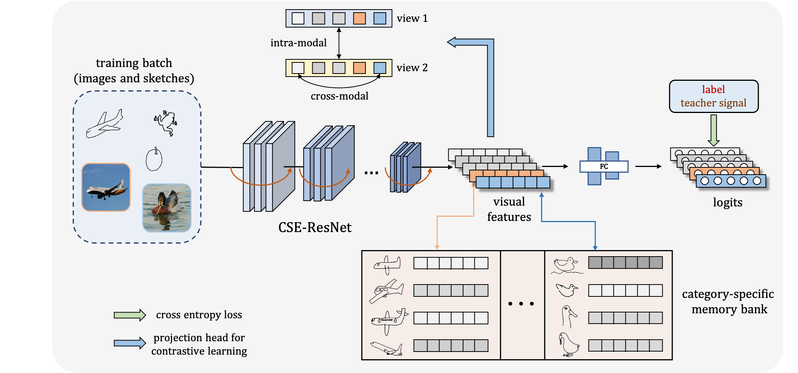

# Domain-Smoothing Network for Zero-Shot Sketch-Based Image Retrieval

This project is our implementation of Domain-Smoothing Network **(DSN)** for Zero-Shot Sketch-Based Image Retrieval. The details in methods and experiments could be found in the [paper](https://arxiv.org/abs/2106.11841)



If you find this project helpful, please consider to cite our paper:

```
@misc{wang2021domainsmoothing,
      title={Domain-Smoothing Network for Zero-Shot Sketch-Based Image Retrieval}, 
      author={Zhipeng Wang and Hao Wang and Jiexi Yan and Aming Wu and Cheng Deng},
      year={2021},
      eprint={2106.11841},
      archivePrefix={arXiv},
      primaryClass={cs.CV}
}
```

## Dataset

The datasets we used are provided by [SAKE](https://github.com/qliu24/SAKE/tree/bdae8d6f04e648fe94b7e4b0f6ae4e09abcfcbc0). You can download the resized Sketchy Ext and TU-Berlin Ext dataset and train/test split files from [here](https://cs.jhu.edu/~qliu24/ZSSBIR/dataset.zip). Then unzip the datasets files to the same directory `./dataset` of this project.

## Training

CSE-ResNet50 model with 64-d features in default setting

```python
# train with Sketchy Ext dataset
python train_cse_resnet_sketchy_ext.py

# train with TU-Berlin Ext dataset
python train_cse_resnet_tuberlin_ext.py
```


## Testing

CSE-ResNet50 model with 64-d features in default setting

```python
# test with Sketchy Ext dataset
python test_cse_resnet_sketchy_zeroshot.py

# test with TU-Berlin Ext dataset
python test_cse_resnet_tuberlin_zeroshot.py
```


## Pre-trained Models

Our trained models for Skethy Ext and TU-Berlin Ext with 64-d features in default setting can be downloaded from [here, passwd: DSN2](https://pan.baidu.com/s/12L9hsoYxH9bglG9lnT6N_Q). Please modify the file name of pre-trained models to `model_best.pth.tar` then put it to the corresponding directory in `./cse_resnet50/checkpoint/`. 

For example, the path of pre-trained model for Sketchy Ext in default experimental setting should be:

`./cse_resnet50/checkpoint/sketchy_kd(1.0)_kdneg(0.3)_sake(1.0)_dim(64)_contrastive(128-0.1)_T(0.07)_memory(10-1.0)/model_best.pth.tar`
